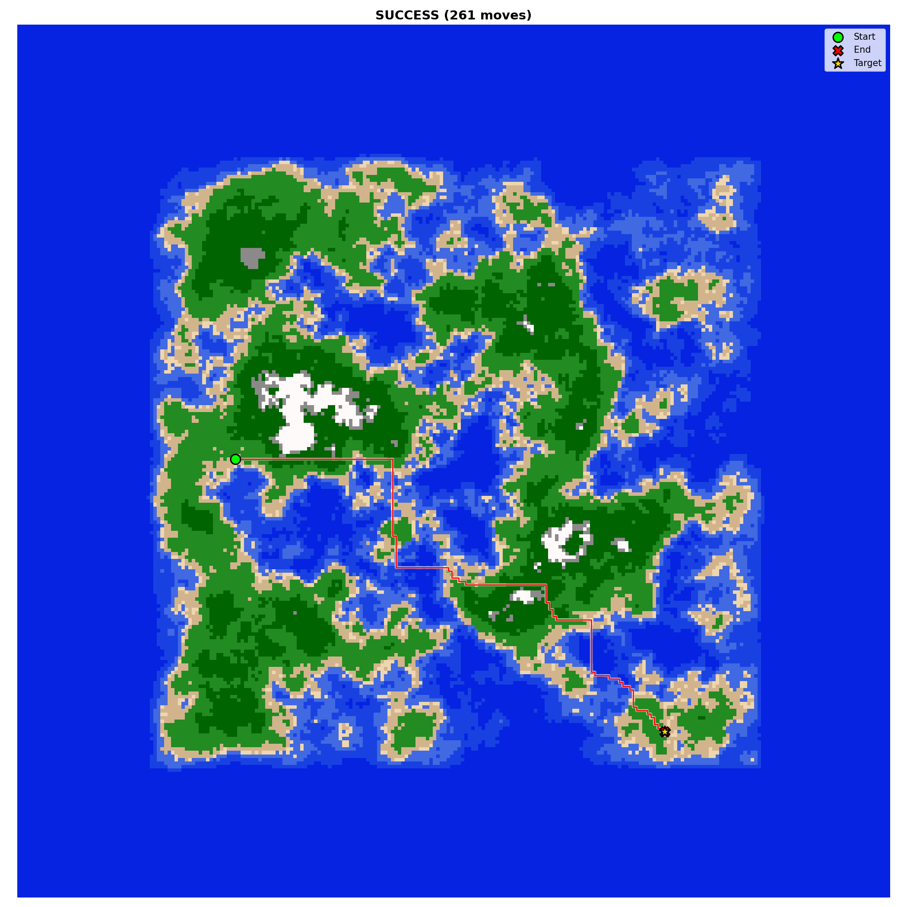

# Cogniland Environment

Cogniland is a navigation task on procedurally generated 250×250 island maps. An agent starts at a random spawn point and must reach a target position while managing health points (HP) and resources. The core challenge is that the optimal path is rarely a straight line — terrain imposes movement costs, resource drains, and strategic opportunities that reward detours through forests, mountain ridges, and water crossings.

---

## Example map with trajectory

<p align="center">
  
</p>

---

## MDP formulation

| Component | Description |
|-----------|-------------|
| **State space** | `minimap` [45×45, 2 ch] + `scalars` [6] — see [Observation space](#observation-space) |
| **Action space** | 4 discrete actions: up, down, left, right |
| **Transition** | Deterministic 1-cell movement; terrain at destination determines resource/HP effects |
| **Reward** | Dense approach reward + sparse reach bonus/death penalty + resource/HP shaping — see [Reward function](#reward-function) |
| **Termination** | Agent reaches target (success), HP ≤ 0 (death), or episode length > 1000 (timeout) |

---

## Observation space

| Field | Shape | Description |
|-------|-------|-------------|
| `minimap` ch 0 | [45, 45] | Heightmap patch centred on the agent |
| `minimap` ch 1 | [45, 45] | Visibility mask (1 = observed, 0 = unseen/occluded) |
| `compass_x`, `compass_y` | scalar × 2 | Unit vector pointing toward target |
| `terrain_idx` | scalar | Current terrain index, normalised to [0, 1] |
| `resources` | scalar | Current resources / `max_resources` (100) |
| `hp` | scalar | Current HP / `max_hp` (100) |
| `visibility_range` | scalar | Current visibility radius / `minimap_max_ray` (22) |

The minimap uses the current visibility radius as its effective range (see terrain table). Cells outside the radius and not yet observed show as unseen.

---

## Action space

| ID | Name  | Effect |
|----|-------|--------|
| 0  | up    | Move one cell north |
| 1  | down  | Move one cell south |
| 2  | right | Move one cell east |
| 3  | left  | Move one cell west |

---

## Terrain types

Each terrain has three key properties: **movement cost** (accumulated in `EnvState.cost`, used for path-efficiency metrics), **visibility radius** (determines the minimap observation range), and **resource effect** (applied every step regardless of action).

| ID | Name       | Mov. cost | Visibility | Resource effect / step | Strategic role |
|----|------------|-----------|------------|------------------------|----------------|
| 0  | ocean      | 0.5       | 10         | −0.7                   | Fast travel: cheaper than land once the boat is built; best for long crossings |
| 1  | deep_water | 0.75      | 8          | −0.5                   | Fast travel: moderate crossing cost |
| 2  | water      | 1.0       | 6          | −0.3                   | Fast travel: cheapest water tier |
| 3  | beach      | 1.5       | 4          | −1.5                   | Transition zone |
| 4  | sandy      | 2.0       | 4          | −1.5                   | Slow, expensive; avoid |
| 5  | grassland  | 1.5       | 4          | −1.5                   | Standard land |
| 6  | forest     | 3.5       | 4          | +8 HP/step or +3 res/step | Resource depot: detour here to resupply before long journeys |
| 7  | rocky      | 3.5       | 8          | −1.5                   | Elevated visibility; moderate cost |
| 8  | mountains  | 4.0       | 22         | −3.0                   | Scouting post: best visibility reveals large map areas; expensive |

**Notes:**
- The agent starts with **80 resources** (`init_resources`). Land terrain drains 1.5/step; at that rate the agent has ~33 steps before hitting the resource threshold (30).
- When resources reach 0, the shortfall is converted to HP loss at `no_res_hp_multiplier = 2.0×` per missing resource unit per step.
- **Forest** is the only terrain that regenerates: heals **+8 HP/step** until `max_hp`, then grants **+3 resources/step**. A 20-step forest detour restores up to 60 resources.

### Land → water transition (boat cost)

Entering any water tile (IDs 0–2) from land (IDs 3–8) costs **20 resources** (boat construction). If the agent is short, each missing resource deals **5 HP** damage instead.

**Break-even analysis:** Water saves 1.2 resources/step vs. grassland (1.5 − 0.3 for shallow water). A crossing must save at least **17 steps of land travel** (`20 / 1.2`) to be resource-neutral — meaningful ocean shortcuts are rewarded, trivial puddle crossings are not.

### Strategic terrain summary

| Terrain | Use when... |
|---------|-------------|
| **Forest** | Resources below ~50 and you have steps to spare; net +3 res/step makes longer journeys viable |
| **Mountains** | Unsure of route ahead; 22-cell visibility reveals terrain obstacles and lets you plan detours |
| **Water** | Target is on the other side and the crossing saves 17+ land steps; water is cheaper per step than land |
| **Sandy/Rocky** | Unavoidable on some maps; pass through quickly, don't linger |

---

## Resource and HP system

```
Each step:
  resources -= terrain_resource_drain

If resources < 0:
  hp -= abs(resources) × no_res_hp_multiplier   (default 2.0)
  resources = 0

Episode ends (death) when hp ≤ 0.
```

Forest applies instead:
```
If hp < max_hp:
  hp += forest_hp_gain   (8.0/step)
Else:
  resources += forest_resource_gain   (3.0/step)
```

There is no passive HP regeneration outside of forest.

---

## Reward function

All coefficients are in `configs/env/default.yaml` and can be overridden via Hydra CLI.

| Component | Formula | Default | Purpose |
|-----------|---------|---------|---------|
| Progress signal | `λ_p (J_{t-1} − J_t)` | λ_p = **0.05** | Dense: reward for reducing Dijkstra cost-to-go |
| Risk penalty | `−λ_ρ ρ_t` | λ_ρ = **0.5** | Dense: penalises entering draining terrain without resources |
| Step penalty | `−λ_s` | λ_s = **0.001** | Dense: discourages dawdling |
| Reach bonus | `r_success + λ_t (time*/time)` | r_success = **100**, λ_t = **40** | Sparse: primary goal + time-efficiency bonus |
| Death penalty | `−λ_d r_success` | λ_d = **1.0** | Sparse: death ends the episode |

**Cost-to-go J_t** is computed via reverse Dijkstra from the target at episode start with edge cost:
```
c(s → s') = τ(s') + β_raft × 1_{land→water}     (β_raft = 10)
```

**Risk proxy ρ_t:**
```
ρ_t = max(0, drain_t) / (res_t + 0.5 hp_t)
```

**Total per-step reward:**
```
r_t = 0.05 (J_{t-1} − J_t)
    − 0.5 ρ_t
    − 0.001
    + 1_reached (100 + 40 time*/time)
    − 1_dead    100
```

**Design intent:** The progress signal uses terrain-aware cost-to-go (not Manhattan distance), so the agent is rewarded for moving along efficient routes that respect terrain costs and water-crossing penalties. The risk penalty discourages entering draining terrain without sufficient resources, making forest detours for recharging worthwhile.

---

## Map generation and curriculum

### Procedural maps

Maps are 250×250 grids generated via simplex noise with square island filtering. The center of the map is always high-elevation land; ocean surrounds the perimeter. A pool of maps is pre-generated at startup (or loaded from a dataset file) for Level Replay — each episode randomly samples a map from the pool.

### Dataset splits

Use `scripts/generate_dataset.py` to pre-generate a dataset with guaranteed train/val/test splits:

```bash
python scripts/generate_dataset.py --seed 42 --train 128 --val 16 --test 16
```

Pass to training with:

```bash
python train.py \
  models.training.dataset.train_path=data/train_seed42_n128.pt \
  models.training.dataset.val_path=data/val_seed42_n16.pt \
  models.training.dataset.test_path=data/test_seed42_n16.pt
```

### Curriculum

When `models.training.dataset.curriculum_switch_steps > 0`, training starts in **EASY** mode: spawn and target are both sampled within a radius-50 circle around the map center, ensuring shorter distances and land-heavy terrain. After `curriculum_switch_steps` global environment steps the env switches automatically to **NORMAL** mode (full-map sampling).

```bash
python train.py \
  models.training.dataset.train_path=data/train_seed42_n128.pt \
  models.training.dataset.val_path=data/val_seed42_n16.pt \
  models.training.dataset.test_path=data/test_seed42_n16.pt \
  models.training.dataset.curriculum_switch_steps=750000
```

---

## Episode lifecycle

```
reset()
  → sample map from pool
  → sample spawn + target on land (EASY: constrained to center radius)
  → init hp=100, resources=80, cost=0

for each step:
  → agent selects action (up/down/left/right)
  → update position, compute terrain effects, update hp/resources
  → compute reward
  → check termination: hp≤0 (death), dist≤0 (reached), steps≥1000 (timeout)

on done:
  → auto-reset (wrappers.py): new map + new spawn/target, carry on
```

---

## Configuration reference

All environment parameters live in `configs/env/default.yaml`. Key groups:

| Group | Key parameters |
|-------|---------------|
| Agent | `init_hp`, `max_hp`, `init_resources`, `max_resources` |
| Terrain effects | `land_resource_drain`, `sea_resource_costs`, `mountain_resource_costs`, `forest_hp_gain`, `forest_resource_gain`, `no_res_hp_multiplier` |
| Water transition | `land_to_water_resource_cost`, `land_to_water_hp_per_missing_res` |
| Reward | `reward.reach_bonus`, `reward.lambda_p`, `reward.lambda_rho`, `reward.lambda_s`, `reward.lambda_t`, `reward.lambda_d`, `reward.beta_raft` |
| Curriculum | `dataset_path`, `curriculum_switch_steps`, `curriculum_easy_radius` |
| Episode | `max_steps` |
