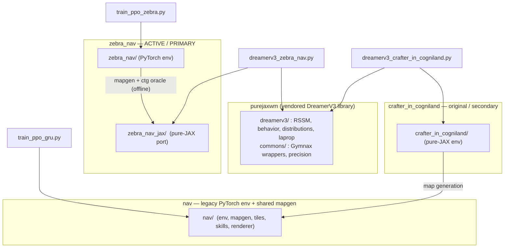
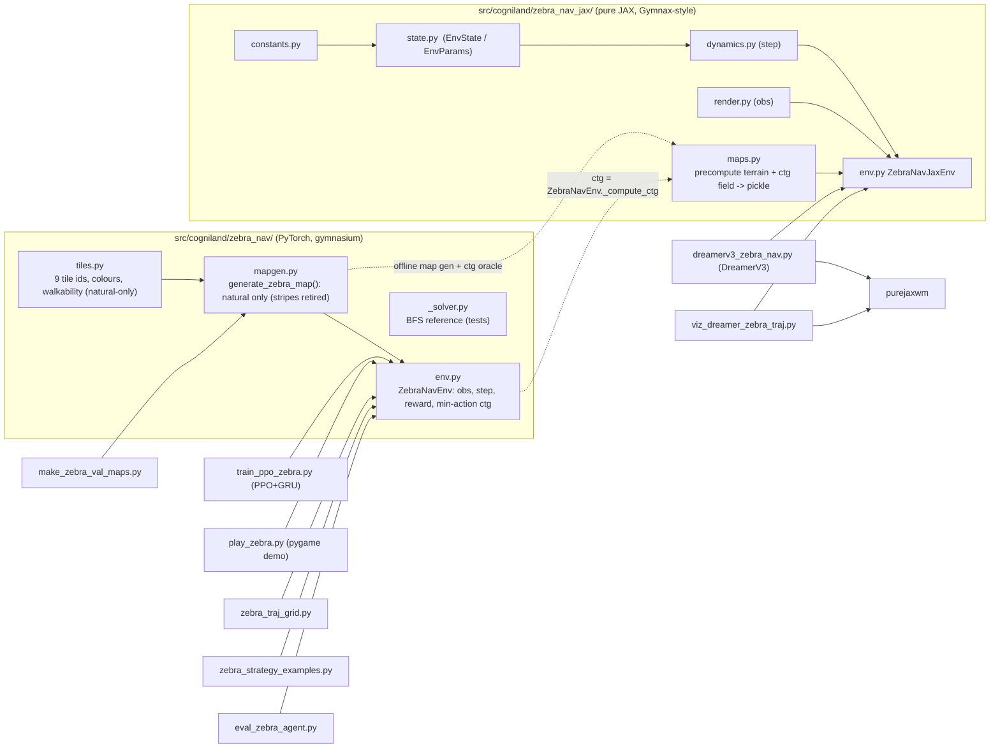
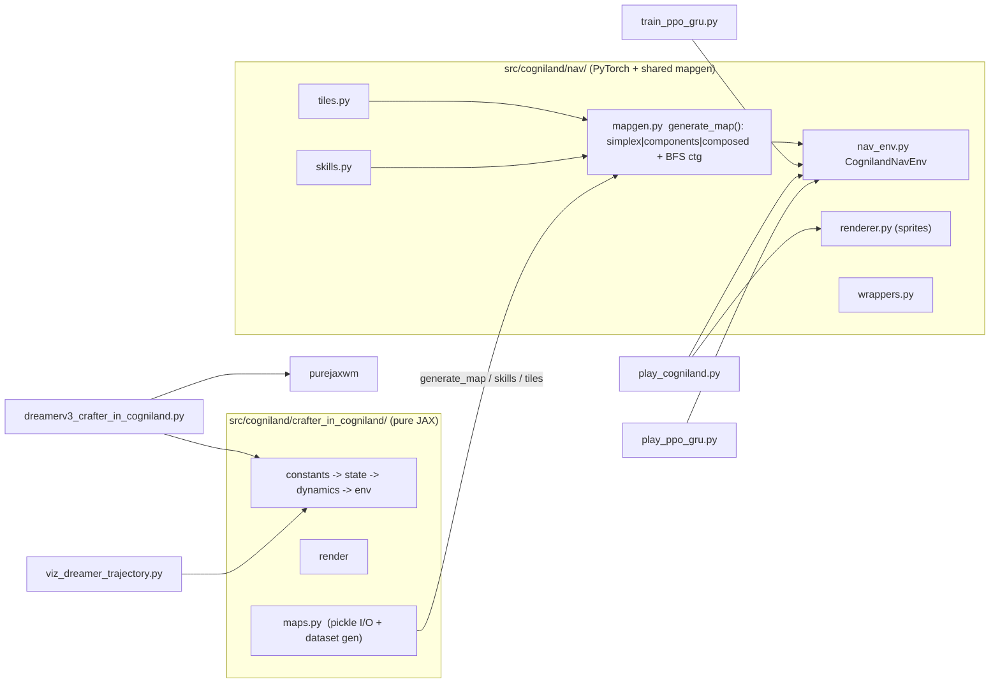

# Codebase map — what is where, and what depends on what

This is the navigation guide for the whole repo. It exists so you can decide
**what to keep and what to remove safely**. Every file is classified into one of
four clusters and tagged:

- ✅ **core** — an active cluster depends on it; do not remove.
- 🟡 **legacy** — works, but belongs to an older line of work; remove only if you
  are also retiring its cluster.
- 🧪 **experimental / orphaned** — nothing imports it and it is not a tool you
  still run; safe deletion candidate (each is justified below).

Nothing here has been deleted — this is a map, not a cleanup. The deletion
candidates are collected in [§5](#5-deletion-candidates).

---

## 1. The four clusters

| Cluster | Status | What it is | Env language | Algorithms |
|---|---|---|---|---|
| **zebra_nav** | ✅ active | The current POMDP: cross water/rock (bridge / mine) or detour, reach a goal on the right. | PyTorch (`zebra_nav/`) + pure-JAX port (`zebra_nav_jax/`) | PPO+GRU **and** DreamerV3 |
| **crafter_in_cogniland** | ✅ secondary | The original build-commitment navigation env (raft vs harness). | pure-JAX | DreamerV3 + PPO |
| **nav** | 🟡 legacy | The first PyTorch nav env. Superseded by zebra_nav, **but its `mapgen`/`tiles` are still imported** by crafter_in_cogniland + paper scripts. | PyTorch | PPO |
| **purejaxwm** | ✅ shared lib | Vendored DreamerV3 (RSSM, actor-critic, TwoHot, LaProp, RetNorm). | JAX | — |

> The two `dreamerv3_*` trainers are the only consumers of `purejaxwm`. The two
> PPO trainers are independent single-file scripts.

---

## 2. zebra_nav — the active project (detail)

Two envs that are **proven bit-for-bit equivalent** (`tests/test_zebra_jax_parity.py`):
the PyTorch `ZebraNavEnv` is the oracle for PPO + the demo; the JAX `ZebraNavJaxEnv`
is the same task made jittable/vmappable so DreamerV3 can train on it.

> **Natural-only (2026-05-31).** 9-tile vocab
> (`GRASS WATER ROCK WOOD TARGET OOB TREE SAND DIRT`), no obsidian/cue tiles, no
> diagonal/vertical stripe orientations (retired — caused phantom lava/diamond
> decoder artifacts). TREE is the sole inviolable tile. Old stripe checkpoints
> deleted; `natural_*` checkpoints are stale under the new ids (retraining).

**Files**

| File | Role | Tag |
|---|---|---|
| `src/cogniland/zebra_nav/{tiles,mapgen,env,_solver,__init__}.py` | PyTorch env (training/demo/eval target) | ✅ core |
| `src/cogniland/zebra_nav_jax/{constants,state,dynamics,render,env,maps,__init__}.py` | JAX port (Dreamer target + parity) | ✅ core |
| `scripts/train_ppo_zebra.py` | PPO+GRU trainer; defines `PPOGRUPolicy` reused by eval/grid scripts via importlib | ✅ core (entry) |
| `scripts/dreamerv3_zebra_nav.py` | DreamerV3 trainer (single file) | ✅ core (entry) |
| `scripts/eval_zebra_agent.py` | deterministic eval grid + success (thin-side retired → 0) | ✅ core (entry) |
| `scripts/zebra_traj_grid.py` | N-rollout stochastic trajectory grid (PPO) | ✅ core (entry) |
| `scripts/zebra_strategy_examples.py` | one clean rollout per strategy (avoid/bridge/tunnel) | ✅ core (entry) |
| `scripts/viz_dreamer_zebra_traj.py` | trajectory grid for the **Dreamer** agent | ✅ core (entry) |
| `scripts/play_zebra.py` | pygame demo (human/AI) | ✅ core (entry) |
| `scripts/make_zebra_val_maps.py` | curate the fixed validation/demo maps | ✅ core (entry) |
| `tests/test_zebra_nav.py`, `tests/test_zebra_jax_parity.py` | env contract + JAX↔PyTorch parity gate | ✅ core |
| `models/zebra_nav/*.pt` + `*.yaml` | released agents + reproducible configs | ✅ core (artifacts) |
| `data/zebra_nav/val_maps.pkl`, `data/zebra_nav_jax/train_*.pkl` | demo/val maps; Dreamer training dataset (regenerable) | ✅ core (artifacts) |
| `scripts/zebra_natural_sweep.yaml`, `launch_zebra_sweep.sh` | W&B sweeps (natural) | ✅ core (tools) |
| `scripts/zebra_sweep.yaml` | DEPRECATED stripe sweep (will error — references retired flags) | 🟡 legacy |

> **Reused-via-importlib pattern:** `eval_zebra_agent.py`, `zebra_traj_grid.py`,
> and `zebra_strategy_examples.py` import `PPOGRUPolicy` from `train_ppo_zebra.py`
> so the policy is defined once. The checkpoint `.pt` stores `{"policy", "args", ...}`,
> and the eval scripts rebuild the net from `args` (tile-count / action-count inferred
> from the state-dict so old checkpoints still load).

**The task default (as of this change):** natural maps, goal = the **entire right
wall** (`goal_half=None`). A positive `goal_half` instead carves a central door —
that was the earlier `natural_agent` variant. The three places that set the goal
mode: the PPO config yaml, `zebra_nav_jax/maps.py:NATURAL_KWARGS`, and
`make_zebra_val_maps.py --goal-half`.

---

## 3. crafter_in_cogniland + nav (detail)

**Key cross-cluster fact:** `crafter_in_cogniland/maps.py` imports
`nav.mapgen` / `nav.skills` / `nav.tiles`. So **`nav/` cannot be deleted** while
crafter_in_cogniland is alive — its map generation is the backbone. `nav_env.py`
(the env class) is the only legacy-superseded part, but the demo/PPO scripts in
this cluster still use it.

**Files (condensed)**

| Group | Files | Tag |
|---|---|---|
| crafter JAX env | `crafter_in_cogniland/{constants,state,dynamics,render,env,maps,__init__}.py` | ✅ core (of this cluster) |
| nav env + shared mapgen | `nav/{tiles,skills,mapgen,nav_env,renderer,wrappers,__init__}.py` | ✅ core — `tiles`/`skills`/`mapgen` shared; `nav_env` cluster-only |
| trainers | `dreamerv3_crafter_in_cogniland.py`, `train_ppo_gru.py` | ✅ core (entry) |
| eval/viz/demo | `viz_dreamer_trajectory.py`, `eval_trajectory_variability.py`, `play_cogniland.py`, `play_ppo_gru.py`, `plot_ppo_on_demo_maps.py` | ✅ core (entry) |
| map gen utils | `generate_demo_maps.py`, `generate_maps.py` | ✅ core (tools) |
| shared helpers | `src/cogniland/inference.py` (PPO `.pt` loader), `src/cogniland/trajectory_variability.py` (numpy metrics) | ✅ core |
| configs | `configs/efficient.yaml`, `configs/diverse.yaml` | ✅ core |
| tests | `tests/test_nav_env.py`, `test_nav_mapgen.py`, `test_trajectory_variability.py`, `tests/purejaxwm/` | ✅ core |

---

## 4. Artifacts (data / models / runs)

| Path | Producer | Consumer | Notes |
|---|---|---|---|
| `data/zebra_nav/val_maps.pkl` | `make_zebra_val_maps.py` | `play_zebra.py`, eval | the demo == validation maps (now whole-wall) |
| `data/zebra_nav_jax/train_natural_*.pkl` | `dreamerv3_zebra_nav.py` (auto) or `maps.py` | Dreamer trainer | regenerable & deterministic; safe to delete |
| `data/crafter_in_cogniland/train_*.pkl` | `generate_maps.py` | crafter Dreamer | regenerable |
| `data/demo_maps/*.pkl` + `*.png` | `generate_demo_maps.py` | `play_cogniland.py`, `play_ppo_gru.py` | curated 12 demo maps |
| `models/zebra_nav/*.pt` + `*.yaml` | training | demo, eval baselines | **released artifacts — keep** |
| `runs/<run>/checkpoints/step_*` | Dreamer trainers (orbax) | viz scripts | params only, not resumable |
| `checkpoints/<run>/*.pt` | PPO trainers | eval/grid/demo | full state |
| `mapgen_preview/*.png`, `paper/figures/*` | preview/paper scripts | — | generated output, safe to delete |

---

## 5. Deletion candidates

Conservative — each has **no intra-repo importers** and is not a tool in the
active loop. Verify against your own memory of what you still run before removing.

| File | Why it's a candidate | Risk |
|---|---|---|
| `scripts/preview_proposed_design.py` | standalone sketch of a 3-biome/3-skill design that was never built; imports nothing in-repo | none |
| `scripts/explore_mapgen.py` | standalone mapgen explorer, not wired into any pipeline; superseded by `gen_maps.py`/`gen_components.py` | none |
| `scripts/launch_sweep.sh` | generic launcher superseded by `launch_ppo_sweep.sh` / `launch_zebra_sweep.sh` / `launch_grass_slip_*.sh` | none |
| `scripts/ppo_sweep.yaml` | old crafter-era sweep spec; not referenced | none |
| `SWEEP_STATUS.md`, `OUTPUT_PROTOCOL.md` | historical status notes (verify they're stale) | low |

**Conditional — tied to the paper.** Keep while iterating on the paper, remove
once it's archived: `paper/gen_*.py`, `scripts/draw_dreamer_split.py`,
`scripts/draw_ppo_architecture.py`, and the mapgen-preview tools
`scripts/{gen_maps,gen_components,preview_simplex_maps}.py` (these are nice as
docs — consider moving under `docs/mapgen/` rather than deleting).

**Whole-cluster decision.** If you ever retire **crafter_in_cogniland**, you can
then also retire the legacy-only part of **nav** (`nav_env.py`, `wrappers.py` and
the `play_cogniland.py` / `train_ppo_gru.py` / `play_ppo_gru.py` /
`plot_ppo_on_demo_maps.py` scripts). You must **keep `nav/{tiles,skills,mapgen}.py`**
as long as crafter_in_cogniland exists. zebra_nav does **not** depend on `nav/` at
all — it has its own `tiles`/`mapgen`.

---

## 6. One-line "where do I start" index

| I want to… | File |
|---|---|
| train the current PPO agent | `scripts/train_ppo_zebra.py --config models/zebra_nav/natural_wholewall.yaml` |
| train the current DreamerV3 agent | `scripts/dreamerv3_zebra_nav.py --size 25M` |
| see an agent play | `scripts/play_zebra.py` |
| compare path diversity | `scripts/zebra_traj_grid.py` (PPO) · `scripts/viz_dreamer_zebra_traj.py` (Dreamer) |
| see one example per strategy | `scripts/zebra_strategy_examples.py` |
| change the maps / goal | `src/cogniland/zebra_nav/mapgen.py` + `make_zebra_val_maps.py` |
| change the env rules | `src/cogniland/zebra_nav/env.py` (then keep `zebra_nav_jax/` in parity — run `tests/test_zebra_jax_parity.py`) |
| understand the Dreamer algorithm | `purejaxwm/dreamerv3/` |

See also: [`zebra_nav.md`](zebra_nav.md) (task guide) and the top-level
[`CLAUDE.md`](../CLAUDE.md) (architecture + invariants).
